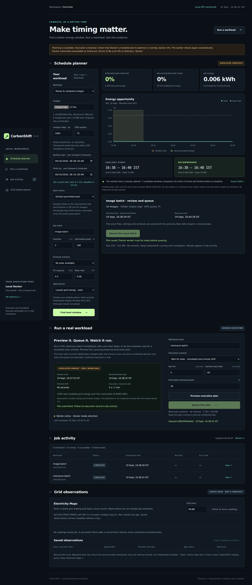
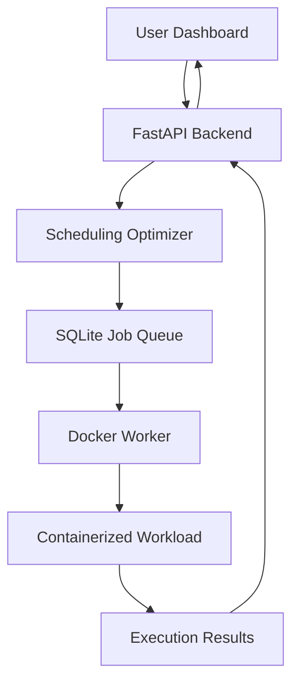

 <div align="center">

# 🌱 CarbonShift

### Run compute when energy is greener.

**A carbon-aware workload scheduler that turns energy-aware decisions into real Docker execution.**


**NextStep Hacks 2026 | Earth Forward**

[Overview](#overview) • [Features](#key-features) • [Architecture](#system-architecture) • [Getting Started](#getting-started) • [Future](#future-roadmap)

</div>

---

# Overview

Computing consumes electricity, but not every computing task needs to execute immediately.

AI training, media processing, database backups, and batch analytics often have flexible execution windows.

Meanwhile, renewable energy availability and electricity grid carbon intensity change throughout the day.

**What if computing workloads could adapt to cleaner energy availability?**

CarbonShift explores this idea by evaluating possible execution windows, selecting a suitable time, and executing the workload using a real Docker worker.

The system combines an optimization engine, a persistent job queue, containerized execution, and an interactive dashboard.

---

# Dashboard Preview



*The actual CarbonShift v0.4 dashboard. Environmental scheduling data shown in the interface is simulated.*

---

# The Problem

Traditional computing systems commonly execute jobs as soon as resources become available, without necessarily considering the environmental characteristics of the electricity being consumed.

However, many batch computing tasks have flexible deadlines.

A workload that must finish by 6 PM might not need to execute at 9 AM.

If cleaner electricity is expected to be available later, delaying the workload could reduce its estimated dependence on grid electricity or associated emissions.

The challenge is to identify an appropriate execution window without violating the job's deadline.

---

# Our Solution

CarbonShift introduces deadline-aware, environmentally informed scheduling.

Instead of simply displaying environmental statistics, it connects the scheduling decision to actual workload execution.

The process is straightforward:

**Submit → Optimize → Schedule → Execute → Verify**

A user submits a computing task with its estimated power requirement, execution duration, and deadline.

The optimizer evaluates candidate execution windows against environmental scenarios.

Once a window is selected, the job is stored in SQLite.

A Docker worker executes it at the scheduled time and records the outcome.

---

# Key Features

### 🌱 1. Carbon-Aware Scheduling

Evaluate multiple execution windows using:

* Estimated workload power
* Execution duration
* Earliest permissible start
* Completion deadline
* Solar energy availability
* Existing site electricity demand
* Grid carbon intensity

The engine supports solar, carbon, and hybrid optimization objectives.

### 📊 2. Interactive Energy Dashboard

Visualize environmental conditions and compare the earliest possible execution time against the recommended window.

The interface displays estimated grid electricity, solar contribution, and associated emissions.

Users can explore how scheduling decisions change under different environmental scenarios.

### ⚙️ 3. Persistent Job Queue

Submitted jobs are stored in SQLite along with their configurations and scheduling decisions.

The worker supervises queued workloads and executes eligible jobs at their selected times.

### 🐳 4. Real Docker Execution

CarbonShift does not stop at recommending an execution time.

A real Docker worker launches supported workloads and records container execution details.

The application tracks execution states, timestamps, exit codes, runtime, and logs.

### 🖼️ 5. Image Processing

Upload JPEG or PNG images and configure the output quality and resolution.

The system schedules and executes the processing job inside Docker.

Completed results are packaged into a downloadable ZIP containing converted JPEG images and an execution report.

### 📋 6. Execution Evidence

Completed jobs preserve execution records, including:

* Container identifiers
* Scheduled and actual execution timestamps
* Exit codes
* Processing information
* Output artifacts
* Runtime-based energy estimates

This makes it possible to distinguish the scheduling prediction from the observed execution result.

---

# Proof of Execution

CarbonShift was tested on a local Linux machine with real Docker execution.

A verified image-processing workload successfully completed and generated a downloadable JPG.

| Verification      | Result                |
| ----------------- | --------------------- |
| Job status        | `SUCCEEDED`           |
| Docker exit code  | `0`                   |
| Output            | JPG image             |
| Download          | ZIP archive           |
| Execution records | Persisted             |
| Worker            | Real Docker container |

The project also includes a checksum workload for demonstrating timed container execution.

**The key achievement is that the application makes a scheduling decision and can act on it.**

---

# System Architecture



## Technology Stack

| Technology            | Purpose                          |
| --------------------- | -------------------------------- |
| Python                | Optimization and backend logic   |
| FastAPI               | HTTP API                         |
| SQLite                | Persistent scheduling queue      |
| Docker                | Containerized workload execution |
| Pillow                | Image processing                 |
| HTML, CSS, JavaScript | Interactive dashboard            |

The current implementation uses a single local Docker worker.

---

# How the Optimization Works

CarbonShift estimates the energy required by a computing task:

$$
E = \frac{P \times t}{1000}
$$

Where:

* E is energy in kilowatt-hours.
* P is estimated power in watts.
* t is execution duration in hours.

For each candidate execution window, CarbonShift estimates the workload's grid electricity requirement and associated emissions according to the selected optimization objective.

The scheduler selects a feasible window that minimizes the chosen estimate while respecting the completion deadline.

For example, a computing job might be shifted from morning to midday when the simulated model predicts greater solar availability.

The workload's estimated total energy does not necessarily decrease. The intended benefit comes from changing when and potentially how that energy is supplied.

---

# Getting Started

## Prerequisites

* Linux
* Python 3.10+
* Docker with a working local daemon
* Internet connection for initial installation

## Installation

Clone the repository:

```bash
git clone https://github.com/Lurrn2757/carbonshift.git
cd carbonshift
```

Start the application:

```bash
bash start.sh
```

Open the dashboard:

**http://127.0.0.1:8088**

The launcher prepares the Python environment, checks Docker availability, and starts the application.

Keep the terminal running while scheduled jobs execute.

## Run Your First Workload

1. Open the Schedule Planner.
2. Select Resize & compress images.
3. Upload a JPEG or PNG image.
4. Configure the processing settings.
5. Select the execution window.
6. Click Find best window.
7. Review the recommendation and queue the batch.
8. Follow execution in Job Activity.
9. Download the processed images after completion.

---

# Testing and Verification

The final development audit reported:

**108 automated tests passed.**

The automated test suite covers application logic and integration paths.

Real Docker execution was also tested separately on the local machine.

Run the tests:

```bash
python3 -m venv .venv
.venv/bin/python -m pip install -r requirements-dev.txt
.venv/bin/python -m unittest discover -s tests -v
```

See `VERIFICATION.md` for further testing information.

---

# Environmental Data and Transparency

CarbonShift currently uses simulated solar and grid carbon scenarios in its dashboard scheduling workflow.

These scenarios demonstrate how the optimization algorithm behaves under different conditions.

The project also includes:

**Open-Meteo:** A separate CLI integration for real weather forecasts and estimated solar generation.

**Electricity Maps:** An optional integration for retrieving grid carbon observations when an authorized API key is available.

These provider integrations are not currently connected to the dashboard's scheduling forecasts.

Actual workload execution is real.

Energy consumption and environmental benefits are estimated rather than directly measured.

CarbonShift does not claim verified real-world carbon savings.

---

# Industrial Applications

The underlying approach could eventually be applied to several industries.

**Data Centres:** Schedule non-urgent computing jobs around periods of cleaner electricity.

**AI Infrastructure:** Shift flexible model training and evaluation workloads while respecting deadlines.

**Media Processing:** Schedule image conversion, video rendering, and transcoding batches.

**Enterprise IT:** Optimize the timing of backups, reporting, and batch analytics.

These are potential industrial applications, not existing production deployments.

---

# Current Limitations

CarbonShift is a working local prototype, not a production-ready distributed orchestration platform.

Current limitations include:

* Simulated environmental inputs in dashboard scheduling.
* One local Docker worker.
* User-configured workload power estimates.
* No direct hardware energy measurement.
* No verified measurements of avoided emissions.
* No public multi-user execution service.

These limitations define the next engineering challenges.

---

# Future Roadmap

### Phase 1: Live environmental forecasting

Connect real weather and grid carbon forecasts directly to the optimizer.

### Phase 2: Automatic workload profiling

Estimate workload power requirements from hardware telemetry and historical executions.

### Phase 3: Distributed execution

Support multiple servers and evaluate both execution time and location.

### Phase 4: Production infrastructure

Introduce authentication, resource management, monitoring, and more advanced scheduling policies.

The long-term vision is to make environmental impact a practical scheduling consideration alongside performance, cost, and reliability.

---

# Built for NextStep Hacks 2026

**Theme: Earth Forward 🌍**

CarbonShift demonstrates how flexible computing workloads can adapt to renewable energy availability rather than always executing immediately.

---

<div align="center">

### Same Compute. Smarter Timing.

**CarbonShift | Run compute when energy is greener. 🌱**

</div>
